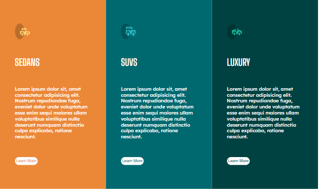
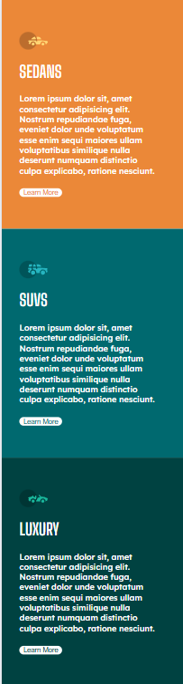

# Car Models Responsive Web Page

This project was created as a homework assignment for the **WBS CODING SCHOOL Full-Stack Software Development course**.

## 📚 Project Objective

The goal of this assignment was to build a **responsive web page showcasing different models of cars**. The exercise was selected from **[Frontend Mentor](https://www.frontendmentor.io/)** — a platform offering real-world UI challenges to improve coding skills.

## 💻 Technologies Used

- HTML5
- CSS3
- Responsive Design (Media Queries, Flexbox/Grid)

## 📱 Features

- Fully responsive layout
- Visually appealing card layout for different car models
- Clean and accessible HTML structure
- Mobile-first design approach

## 🖼️ Preview

Here’s a preview of the car models design:

## 📌 Notes

This is a practice project aimed at improving front-end development skills by working with real-world design mockups. Feedback and suggestions are always welcome!

## 🙌 Acknowledgment

Special thanks to **Khaled Alabssi** for teachimg me how to do this.